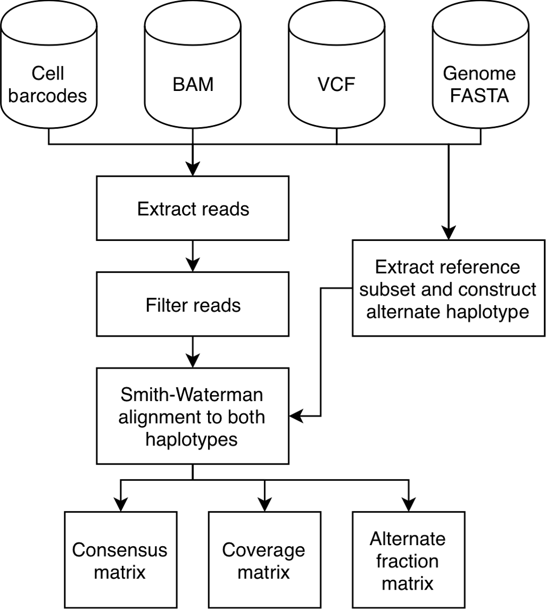
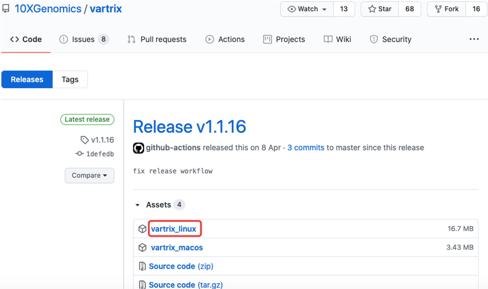
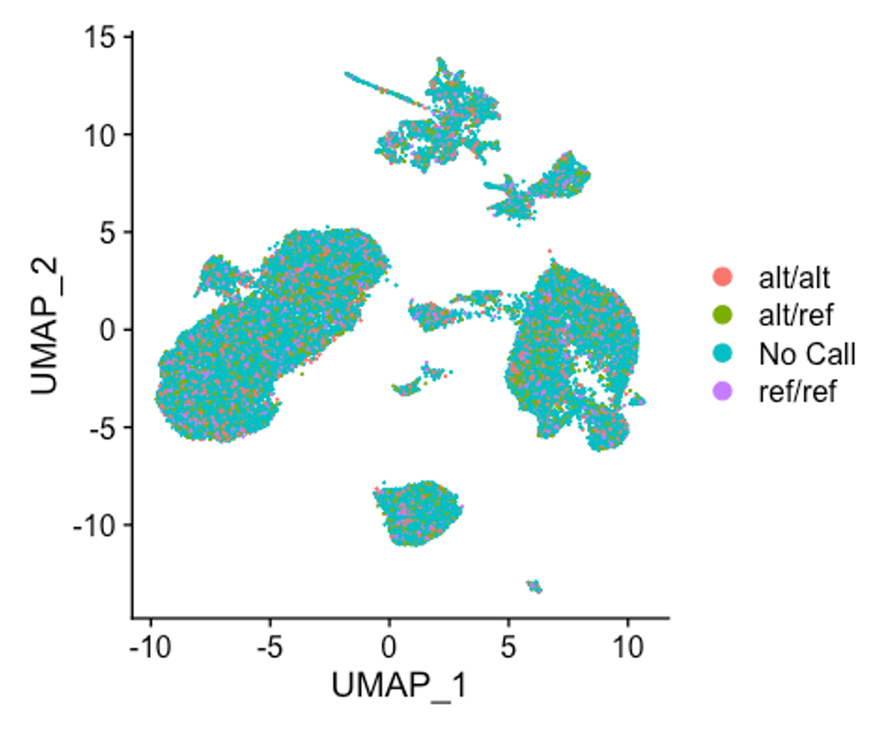

VarTrix是一款10XGenomics官方的软件用于从10XGenomics单细胞数据中提取单细胞变异信息。

* VarTrix 并不执行`variant calling`
* 需要输入先前定义的`variant calls`
* VarTrix可用于评估样品中单细胞的异质性

## VarTrix 流程图


## github
https://github.com/10XGenomics/vartrix

## 下载安装
VarTrix使用rust语言编写，官方提供了编译后的[二进制文件](https://github.com/10XGenomics/vartrix/releases/tag/v1.1.16)，直接下载就能使用。



我们以linux版为例，下载后执行增加可执行权限。
```shell
chmod +x vartrix_linux
```

## 测试
### 下载测试数据
为了快速理解VarTrix的使用，我们从github下载其测试数据
https://github.com/10XGenomics/vartrix/test

test目录里提供了多套测试数据，我们选下面这一组输入文件做测试：

* test_dna.vcf
  单样品的VCF格式变异文件，用于输入
* test_dna.bam，test_dna.bam.bai
  Input Cell Ranger BAM，需要有index文件
* test_dna.fa, test_dna.fa.fai
  FASTA格式的参考基因组文件，需要有index文件
* dna_barcodes.tsv
  Cell Ranger输出的矩阵barcode文件

### 使用说明
`./vartrix_linux -h`查看程序使用说明
```
vartrix 1.1.14
Ian Fiddes <ian.fiddes@10xgenomics.com> and Patrick Marks <patrick@10xgenomics.com>
Variant assignment for single cell genomics

USAGE:
    vartrix_linux [FLAGS] [OPTIONS] --bam <FILE> --cell-barcodes <FILE> --fasta <FILE> --vcf <FILE>

FLAGS:
    -h, --help                  Prints help information
        --no-duplicates         Do not consider duplicate alignments
        --primary-alignments    Use primary alignments only
        --umi                   Consider UMI information when populating coverage matrices?
    -V, --version               Prints version information

OPTIONS:
    -b, --bam <FILE>                         Cellranger BAM file
        --bam-tag <bam_tag>                  BAM tag to consider for marking cells? [default: CB]
    -c, --cell-barcodes <FILE>               File with cell barcodes to be evaluated
    -f, --fasta <FILE>                       Genome fasta file
        --log-level <log_level>              Logging level [default: error]  [possible values: info, debug, error]
        --mapq <INTEGER>                     Minimum read mapping quality to consider [default: 0]
    -o, --out-matrix <OUTPUT_FILE>           Output Matrix Market file (.mtx) [default: out_matrix.mtx]
        --out-variants <OUTPUT_FILE>         Output variant file. Reports ordered list of variants to help with loading into
                                             downstream tools
    -p, --padding <INTEGER>                  Number of padding to use on both sides of the variant. Should be at least 1/2 of read
                                             length [default: 100]
        --ref-matrix <OUTPUT_FILE>           Location to write reference Matrix Market file. Only used if --scoring-method is
                                             coverage [default: ref_matrix.mtx]
    -s, --scoring-method <scoring_method>    Type of matrix to produce. In 'consensus' mode, cells with both ref and alt reads are
                                             given a 3, alt only reads a 2, and ref only reads a 1. Suitable for clustering.  In
                                             'coverage' mode, it is required that you set --ref-matrix to store the second matrix
                                             in. The 'alt_frac' mode will report the fraction of alt reads, which is effectively the
                                             ratio of the alternate matrix to the sum of the alternate and coverage matrices.
                                             [default: consensus]  [possible values: consensus, coverage, alt_frac]
        --threads <INTEGER>                  Number of parallel threads to use [default: 1]
        --valid-chars <valid_chars>          Valid characters in an alternative haplotype. This prevents non sequence-resolved
                                             variants from being genotyped. [default: ATGCatgc]
    -v, --vcf <FILE>                         Called variant file (VCF)
```

### 测试代码
```shell
./vartrix_linux -v ./test_dna.vcf -b ./test_dna.bam -f ./test_dna.fa -c ./dna_barcodes.tsv -o ./matrix.mtx
```

vartrix的输出文件格式与Cell Ranger类似，

* 第1列：VCF中的SNP所在行号
* 第2列：barcode在barcodes.tsv中的行号
* 第3列：相应barcode（细胞）SNP鉴定结果

其中第3列的值只有`0，1，2，3`这四种，分别代表：

* 0 : No Call
* 1 : ref/ref
* 2 : alt/alt
* 3 : alt/ref

```
# head(./matrix.mtx)
%%MatrixMarket matrix coordinate real general
% written by sprs
46 1331 1073
1 8 1
1 73 1
1 154 2
1 174 1
1 191 2
1 194 2
1 243 1
```

## UMAP图中展示VarTrix结果
要想在各细胞亚群UMAP图中展示VarTrix结果，我们需要先用seurat对细胞做常规分群分析，然后把VarTrix结果作为MetaData添加给Seurat对象。

### VarTrix结果转为可添加给Seurat对象的MetaData

variants文件转为类似于geneID的格式，相当于给每个变异一个唯一的编号（以染色体及变异具体位置命名）

```shell
awk '{print $1,$2}' test_dna.vcf > SNV.loci.txt
sed -i 's/\s/:/g' SNV.loci.txt 
```

`head SNV.loci.txt`

```
#CHROM:POS
1:13116
1:13118
1:13656
1:15211
1:15274
```
#### 读取VarTrix的结果matrix, barcodes和variants
```R
library(Seurat)
library(Matrix)
library(stringr)

setwd("~/Documents/RD/Rs/VarTrix")
snv_matrix <- readMM("matrix.mtx")

# convert the matrix to a dataframe
snv_matrix <- as.data.frame(as.matrix(t(snv_matrix)))
#read in the cell barcodes output by Cell Ranger
barcodes <- read.table("dna_barcodes.tsv", header = F)

# read in SNV loci
# Should be constructed a single column. For example

# chr1:1234-1235
# chr2:2345-2346

# Construct the final table to add to the Seurat object
snps <- read.table("SNV.loci.txt", header = F)
colnames(snv_matrix) <- barcodes$V1
row.names(snv_matrix) <- snps$V1

snv_matrix_t <- as.data.frame(t(snv_matrix))

snv_matrix_t <- str_replace(as.character(snv_matrix_t), "0", "No Call")
snv_matrix_t <- str_replace(as.character(snv_matrix_t), "1", "ref/ref")
snv_matrix_t <- str_replace(as.character(snv_matrix_t), "2", "alt/alt")
snv_matrix_t <- str_replace(as.character(snv_matrix_t), "3", "alt/ref")
```

#### 添加VarTrix信息给Seurat对象
```R
Seurat.obj<-readRDS("/path/Step5_combinedObj.rds")
Seurat.obj <- AddMetaData(object = Seurat.obj, metadata = snv_matrix_t)
```

**UMAP展示**
```R
UMAPPlot(object = Seurat.obj, group.by = "1:13116")
```


#### UMAP展示结果
因为VarTrix的github并未提供基因表达矩阵，所以VarTrix结果在UMAP中的展示我们暂用模拟数据代替

下面是模拟VarTrix结果添加给Seurat对象及可视化代码。

```R
Seurat.obj<-readRDS("~/Desktop/blish_covid.seu.rds")
gts <- data.frame(snp_0001=rep(0, times=length(names(Seurat.obj$nFeature_RNA))),snp_0002=rep(1, times=length(names(Seurat.obj$nFeature_RNA))))
rownames(gts) <- names(Seurat.obj$nFeature_RNA)
gts[sample(rownames(gts),4000), "snp_0001"] <- 1
gts[sample(rownames(gts),5000), "snp_0001"] <- 2
gts[sample(rownames(gts),6000), "snp_0001"] <- 3

gts$snp_0001 <- str_replace(as.character(gts$snp_0001), "0", "No Call")
gts$snp_0001 <- str_replace(as.character(gts$snp_0001), "1", "ref/ref")
gts$snp_0001 <- str_replace(as.character(gts$snp_0001), "2", "alt/alt")
gts$snp_0001 <- str_replace(as.character(gts$snp_0001), "3", "alt/ref")

Seurat.obj <- AddMetaData(object = Seurat.obj, metadata = gts)

UMAPPlot(object = Seurat.obj, group.by = "snp_0001")
```




其中`blish_covid.seu.rds`来自下面这篇文章
> Wilk A J, Rustagi A, Zhao N Q, et al. A single-cell atlas of the peripheral immune response in patients with severe COVID-19[J]. Nature Medicine, 2020: 1-7.

> `2020是不平凡的一年，在年钟来临之际，我们计划组织一次单细胞线上高级分析培训班，我们将以这篇文章的数据为基础线索进行高级分析的代码重现`，另外还有marker gene可视化应用代码的赠送。


